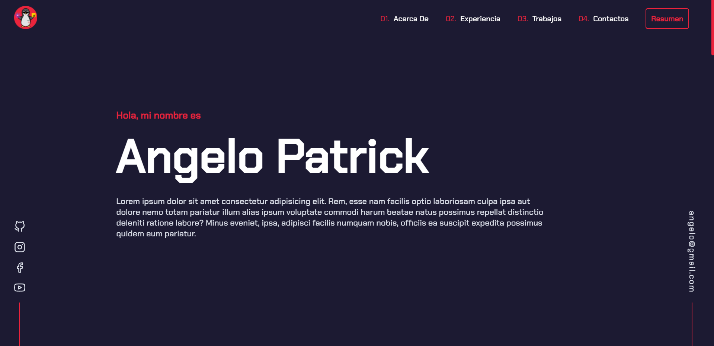

  

<h1 align="center">
  patrick_portfolio v2.0
</h1>

 
This project is built from scratch with basic web technologies like html, css and javascript.

  Other versions
    <a href="https://github.com/DonVoid18/angelopatrick" target="_blank">v1.0</a>

  

    &#128073; This project has an explanation video &#127916;
    <a href="https://youtu.be/8b0Qzp_9d40" target="_blank">PortfolioWeb</a>

    &#128073; My youtube channel &#127909;
    <a href="https://www.youtube.com/c/angelox2Patrick" target="_blank">angelo x2</a>

    &#128073; Página de facebook &#128153;
    <a href="https://www.facebook.com/Programador347-101320832263307" target="_blank">programador347</a>

<h2 align="left">
  Project information
</h2>

 
This project has been created from scratch with html, css and javascript.

 
&#127775; The design is inspired by the page of <a href="https://brittanychiang.com/" target="_blank">brittanychiang</a>

